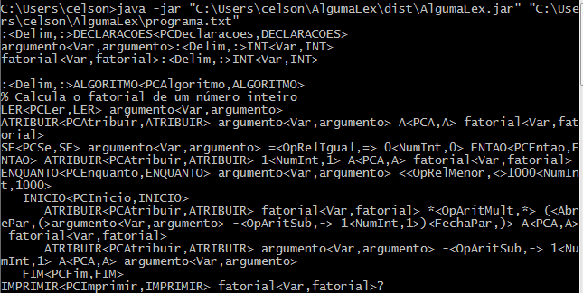

# ANALISADOR LÉXICO

Análise léxica é o processo de analisar a entrada de linhas de caracteres (tal como o código-fonte de um programa de computador) e produzir uma sequência de símbolos chamado "símbolos léxicos" (lexical tokens), ou somente "símbolos" (tokens), que podem ser manipulados mais facilmente por um parser (leitor de saída). O componente do compilador responsável pela execução desse processo é conhecido como Analisador léxico.

O analisador léxico, ou scanner como também é chamado, faz a varredura do programa fonte caractere por caractere e, traduz em uma sequência de símbolos léxicos ou tokens. É nessa fase que são reconhecidas as palavras reservadas, constantes, identificadores e outras palavras que pertencem a linguagem de programação. O analisador léxico executa outras tarefas como por exemplo o tratamento de espaços, eliminação de comentários, contagem do número de linhas que o programa possui e etc.

A análise léxica é a forma de verificar determinado alfabeto. Quando analisamos uma palavra, podemos definir através da análise léxica se existe ou não algum caractere que não faz parte do nosso alfabeto, ou um alfabeto inventado por nós.

É a primeira etapa do processo de compilação e seu objetivo é dividir o código fonte em símbolos, preparado-o para a Análise Sintática. Neste processo pode-se destacar três atividades como fundamentais:

* Extração e classificação dos tokens;
* Eliminação de delimitadores e comentários;
* Recuperação de Erros.
* O analisador léxico funciona de duas maneiras:

Primeiro estado da análise: A primeira etapa lê a entrada de caracteres, um de cada vez, mudando o estado em que os caracteres se encontram. Quando o analisador encontra um caracter que ele não identifica como correto, ele o chama de "estado morto" então, ele volta à última análise que foi aceita e assim tem o tipo e comprimento do léxico válido.
Um léxico, entretanto, é uma única lista de caracteres conhecidas de ser um tipo correto. Para construir um símbolo, o analisador léxico necessita de um segundo estado.

Segundo estado da análise: Nesta etapa são repassados os caracteres do léxico para produzir um valor. O tipo do léxico combinado com seu valor é o que adequadamente constitui um símbolo, que pode ser dado a um parser. (Alguns símbolos tais como parênteses não têm valores, e então a função da análise pode retornar nada).
A análise léxica escreve um parser muito mais fácil. Em vez de ter que acumular, renomeia seus caracteres individualmente. O parser não mais se preocupa com símbolos e passa a preocupar-se só com questões de sintática. Isto leva a eficiência de programação, e não eficiência de execução. Entretanto, desde que o analisador léxico é o subsistema que deve examinar cada caracter único de entrada, podem ser passos intensivos e o desempenhos se torna crítico, pode estar usando um compilador.

As desvantagens da Análise Léxica são o tratamento de dados em branco, formato fixo de entrada e a inexistência de palavras reservadas, em determinadas linguagens.




#### IMPLEMENTAÇÃO DE UM ANALISADOR LÉXICO UTILIZANDO LINGUAGEM ALGUMA
```
:DECLARACOES
argumento:INT
fatorial:INT

:ALGORITMO
% Calcula o fatorial de um número inteiro
LER argumento
ATRIBUIR argumento A fatorial
SE argumento = 0 ENTAO ATRIBUIR 1 A fatorial
ENQUANTO argumento <1000
   INICIO
      ATRIBUIR fatorial * (argumento - 1) A fatorial
      ATRIBUIR argumento - 1 A argumento
   FIM
IMPRIMIR fatorial

´´´

UTILIZANDO JAVA

